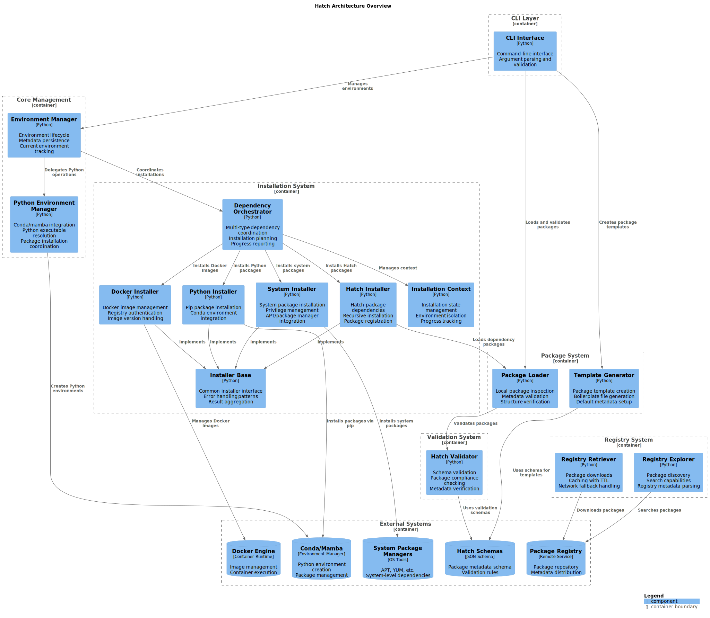

# System Overview

This article is about:

- High-level introduction to Hatch's architecture and core concepts
- System components and their relationships
- Key architectural patterns and design decisions

## Introduction

Hatch is a sophisticated package management system designed for the CrackingShells ecosystem, featuring modular architecture with clear separation of concerns. It serves as the foundation for managing MCP server packages, environments, and registry interactions.

## Components

## Core System Layers

### CLI Layer

The command-line interface provides the primary user interaction point:

- **`hatch/cli_hatch.py`** - Command-line interface with argument parsing and validation
- Delegates operations to appropriate management components
- Provides consistent user experience across all operations

### Environment Management Layer

Manages isolated environments for package installation:

- **Environment Manager** - Core environment lifecycle and state management
- **Python Environment Manager** - Specialized Python environment integration via conda/mamba
- **Environment Isolation** - Ensures packages don't interfere between environments

### Package System Layer

Handles package operations and metadata:

- **Package Loader** - Local package inspection and metadata validation
- **Template Generator** - Package template creation with boilerplate generation
- **Package Validation** - Ensures packages conform to schema standards

### Registry System Layer

Manages remote package discovery and retrieval:

- **Registry Retriever** - Package downloads with caching and fallback handling
- **Registry Explorer** - Package discovery and search capabilities
- **Caching Strategy** - TTL-based caching for performance optimization

### Installation System Layer

Coordinates multi-type dependency installation:

- **Dependency Orchestrator** - Coordinates installation across multiple dependency types
- **Installation Context** - Manages installation state and progress tracking
- **Installer Framework** - Extensible installer system using strategy pattern

## System Architecture

## Key Architectural Patterns

### Strategy Pattern

Used extensively in the installer framework:

- Abstract installer interface defines common operations
- Concrete installers implement specific dependency types
- Registry-based installer discovery and instantiation

### Template Method Pattern

Applied in installation workflows:

- Orchestrator defines installation workflow steps
- Individual installers implement specific installation logic
- Centralized consent management and progress reporting

### Cache Management Pattern

Implemented throughout the system:

- TTL-based caching for registry data and packages
- Configurable cache directories and expiration policies
- Fallback mechanisms for offline operation

## Component Relationships

### Environment to Package Flow

1. User creates or selects environment
2. Environment manager initializes environment metadata
3. Package operations are scoped to the active environment
4. Installation system coordinates dependency resolution

### Package Installation Flow

1. Package metadata is loaded and validated
2. Dependencies are analyzed and resolved
3. Installation orchestrator coordinates multi-type installation
4. Progress is tracked and reported to user

### Registry Integration Flow

1. Registry explorer discovers available packages
2. Registry retriever downloads and caches packages
3. Package loader validates downloaded packages
4. Installation system processes package dependencies

## Design Principles

### Modularity

- Clear separation of concerns across components
- Well-defined interfaces between system layers
- Minimal coupling between unrelated components

### Extensibility

- Plugin-based architecture for installers
- Registry pattern for component discovery
- Abstract interfaces for easy extension

### Reliability

- Comprehensive error handling and recovery
- Robust caching with fallback mechanisms
- Environment isolation prevents interference

### Performance

- Efficient caching strategies reduce network calls
- Parallel installation where possible
- Optimized dependency resolution algorithms

## For New Developers

Understanding this system overview provides the foundation for working with Hatch:

1. **Start Here** - This overview gives you the big picture
2. **Dive Deeper** - See [Component Architecture](./component_architecture.md) for detailed component information
3. **Get Hands-On** - Follow [Developer Onboarding](../development_processes/developer_onboarding.md) for practical next steps
4. **Implementation** - Check [Implementation Guides](../implementation_guides/) when ready to implement features

## Related Documentation

- [Component Architecture](./component_architecture.md) - Detailed component breakdown
- [Implementation Guides](../implementation_guides/) - Technical implementation guidance
- [Development Processes](../development_processes/) - Development workflow and standards
